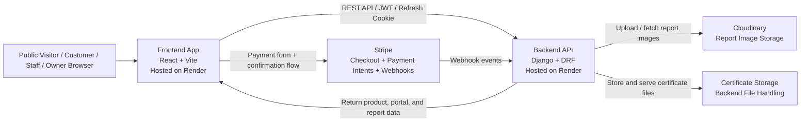

# Manley Lifting Platform

A combined marketing site, product shop, customer portal, and internal operations platform for Manley Lifting.

This README is written as a presentation-ready guide for a prospective owner. It explains what the site does, who it serves, what is already implemented, the operational safeguards built into it, and the kinds of edge cases and validation messages users will encounter in real use.

## Live URLs

- Frontend: https://manleylifting.onrender.com/
- Backend API: https://manleyliftingback.onrender.com/

## What This Platform Is

This is not just a brochure website. It is a multi-part platform with four clear business functions:

1. A public-facing marketing website for lead generation and trust building.
2. A product shop with cart and Stripe-based checkout.
3. A protected customer portal for equipment visibility, reports, and certificates.
4. An internal workflow system for owners and staff to manage companies, employees, equipment, inspections, approvals, and audit history.

In practical terms, it lets Manley Lifting market services, sell products, manage customer accounts, schedule and record inspections, approve reports, track certificates, and preserve a proper operational trail.

## Text Walkthrough of the Site

This section gives a text-only walkthrough for presentation settings where images are unavailable or unreliable.

### Public Site Walkthrough

1. A visitor lands on the homepage and immediately sees the business positioning, trust language, and service categories.
2. From the top navigation and call-to-action buttons, the visitor can choose one of three clear routes:
	- contact the business
	- browse products in the shop
	- enter the portal
3. The contact route supports service leads and enquiry conversion.
4. The shop route supports product discovery, cart management, and checkout.
5. Legal and policy pages are always accessible from footer navigation, which gives commercial completeness.

### Portal Login Walkthrough

1. Users authenticate through a dedicated portal login page.
2. After login, users are routed into role-appropriate views rather than a one-size-fits-all dashboard.
3. Access is restricted by role and company assignment, so users only see what they are entitled to see.

## Role Comparison (Text-Only)

### Customer Experience

- customers are scoped to their own company data
- customers can view equipment records and approved documentation
- internal management and approval controls are hidden

### Engineer Experience

- engineers can move across assigned customer accounts
- engineers can open equipment details and create report drafts
- engineers can submit reports for owner approval
- engineer tools focus on field operations and reporting workflow

### Office Staff Experience

- office staff can coordinate across customer accounts and equipment views
- office staff can support workflow administration and operational follow-up
- office staff have broader operational visibility than customers while still remaining below owner authority

### Owner Experience

- owners can manage customers and employees
- owners can open customer profiles and equipment hubs
- owners can review submitted reports and approve them
- owners can use pending approvals and revision workflows for quality control

### Why the Role Comparison Matters

This role separation shows the platform is an operational system, not a generic login area. Each user type gets a purpose-built experience aligned to real responsibilities, which reduces mistakes and supports scalable team growth.

## Owner Workflow (Text Sequence)

1. Open portal and access customer list.
2. Open a customer profile.
3. Open equipment details.
4. Review a submitted report.
5. Approve report (or edit/reject as needed).
6. Use employee controls and company settings for ongoing governance.

## High-Level Selling Points

If you are presenting this to a prospective owner, these are the strongest points to emphasize:

- It combines sales, lead generation, compliance workflow, and customer self-service in one product.
- It supports multiple user roles with different permissions instead of treating every user the same.
- It is structured around the real operational lifecycle of lifting equipment inspections.
- It already includes important business safeguards such as approvals, revision history, audit logging, upload validation, and access isolation.
- It has enough depth to support both day-to-day operations and future expansion.

## Architecture Diagram

What this shows a prospective owner:

- the frontend and backend are cleanly separated
- payments are delegated to Stripe instead of being custom-built unsafely
- inspection media is handled through a dedicated image service
- the deployed architecture is already production-shaped rather than monolithic

## Business KPI and Operational Value

One of the strongest ways to sell this platform is to frame it not only as a website, but as a reduction in manual admin.

### Manual Process Replacement Map

| Manual process | What businesses often do today | What this platform replaces it with |
| --- | --- | --- |
| Email chains for report requests | Customers email asking for latest inspection docs | Customer portal with approved reports and certificates |
| Spreadsheets for equipment tracking | Asset lists maintained manually with due dates | Equipment records with status, inspection interval, and next due date |
| PDF folders on shared drives | Reports scattered across drives and email attachments | Structured report records linked to equipment and companies |
| Ad-hoc approval by phone or WhatsApp | Staff verbally confirm issues and owners approve informally | Submitted-to-approved report workflow with explicit owner approval |
| Paper-based inspection notes | Engineers record issues in notebooks and retype them later | Draft reports with structured checklist items and image uploads |
| Staff access confusion | Shared logins or unclear permissions | Role-based access with company-level visibility rules |
| Repeated customer follow-up | Customers ask repeatedly for certificates and status | Self-service portal visibility for approved documents |

### KPI-Style Owner Talking Points

- Fewer admin handoffs: approved reports and certificates can be retrieved by customers without manual resend requests.
- Better compliance visibility: overdue and due-soon equipment can be surfaced centrally instead of tracked in separate spreadsheets.
- Stronger accountability: approvals, edits, deletions, and status changes leave an operational trail.
- Faster field-to-office workflow: staff can save drafts in progress instead of losing work or waiting to finish everything in one session.
- Better onboarding for growth: the business can add engineers and office staff without giving everyone full access to everything.
- Cleaner commercial presentation: the same platform handles public trust-building, product sales, and after-sales customer service.

### Demo Data Snapshot

The current live demo environment is also useful as a selling point because it demonstrates scale rather than a toy example.

- 20 customer companies
- 20 equipment records per company
- mixed report states across draft, submitted, and approved
- pending approval queue for owner review
- active employee roster with engineers and office staff

## Public Website Features

### Marketing Homepage

The homepage is designed to present Manley Lifting as a credible, family-run, specialist business. It includes:

- A branded hero section with direct calls to action.
- A services overview covering inspection, testing, certification, training, supply, and installation.
- Trust and compliance messaging to support credibility with industrial buyers.
- Quick paths into the customer portal, quote requests, and the shop.
- Footer-based legal and company detail navigation.

Why this matters to an owner:

- It gives the business a professional front door.
- It helps convert unknown visitors into enquiries.
- It sets the tone for trust before a customer ever logs into the portal.

### Contact and Enquiry Flow

The contact section is more than a static contact card. It includes:

- A dedicated contact page.
- A structured enquiry form.
- Clear contact messaging for direct outreach.
- Legal and company information in the footer.

Why this matters:

- It supports both lead capture and customer reassurance.
- It reduces friction for customers who are not ready to log into the portal or buy immediately.

### Legal and Compliance Pages

The platform includes dedicated pages for:

- Privacy Policy
- Cookie Policy
- Terms and Conditions
- Returns and Refunds
- Shipping and Delivery
- Accessibility Statement

Why this matters:

- It makes the site look complete and commercially serious.
- It reduces legal and trust gaps for both shoppers and portal users.

### Cookie Consent

The site includes cookie preference handling with options to accept, reject non-essential cookies, or manage preferences.

Why this matters:

- It gives the public site a more production-ready, privacy-aware experience.
- It is a visible sign that the business takes compliance seriously.

## Shop and Checkout Features

### Product Catalogue

The shop supports:

- Featured products.
- Collections-based browsing.
- Individual product detail pages.
- Pricing and product metadata.

Why this matters:

- It opens a direct sales channel.
- It makes the business look more established than a services-only site.
- It allows the platform to support both services revenue and product revenue.

### Cart Experience

The shopping flow includes:

- Add-to-cart controls.
- Quantity changes.
- Cart review.
- Toast-based feedback when items are added or updated.

Why this matters:

- It gives immediate feedback to shoppers.
- It makes the buying flow feel modern instead of static.

### Checkout and Payments

The checkout flow supports:

- On-site checkout.
- Stripe payment processing.
- Order confirmation.
- Payment status handling.
- Basic anti-abuse/rate-limit protections.

Why this matters:

- It shows the platform can handle actual transactions, not just enquiries.
- It gives the owner a clear path to e-commerce growth.

## Portal Overview

The portal is the most commercially valuable part of the platform. It is role-based and designed around operational reality rather than generic account pages.

### Portal Roles

The system supports these role types:

- Customer
- Engineer
- Office Staff
- Owner
- Superuser

The important point is not just that roles exist, but that each role sees and can do different things.

### Customer Role

A customer can:

- Sign in to a branded portal.
- View only the companies and equipment assigned to them.
- View approved reports.
- View certificates tied to their equipment.
- Access the data they need without seeing internal-only editing tools.

Why this matters:

- Customers get transparency and self-service.
- The business reduces the need to manually send reports and certificates every time they are requested.
- The owner keeps sensitive internal workflows hidden from customers.

### Engineer Role

Engineers can:

- View assigned companies.
- Create inspection reports.
- Save reports as drafts.
- Submit reports for approval.
- Upload supporting report images.
- Upload certificates.
- Edit only their own draft reports.

Why this matters:

- Engineers can work asynchronously.
- The draft system supports incomplete work and field-based workflows.
- The approval step protects quality and compliance.

### Office Staff Role

Office staff can:

- Access internal portal workflows.
- Work across company assignments.
- Support operational coordination.
- Manage equipment- and report-related workflows at a broader level than customers.

Why this matters:

- The platform is not bottlenecked around one owner login.
- Administrative support staff can help keep inspections and records moving.

### Owner Role

The owner has the broadest operational view and control. Owner capabilities include:

- Viewing all visible companies.
- Managing customers.
- Creating and managing employee assignments.
- Reviewing pending report approvals.
- Editing submitted or approved reports.
- Approving reports.
- Reviewing report revision history.
- Accessing broader operational dashboards and internal controls.

Why this matters:

- It gives the owner oversight without forcing them into every draft step.
- It preserves accountability while still allowing delegation.

## Customer and Company Management

The owner-facing customer management area supports:

- Creating a company and customer account together.
- Assigning company contact details.
- Viewing customer/company lists.
- Searching and filtering customers.
- Exporting customer data to CSV.
- Editing company information.
- Deactivating customer/company records.

What makes this strong:

- It is not just a user list; it is structured around actual business customers.
- It supports operational administration rather than only authentication.

## Employee Management

The employee controls support:

- Creating engineer and office staff accounts.
- Assigning allowed companies.
- Changing roles.
- Deactivating and reactivating staff.
- Managing active and inactive employee views.
- Preventing accidental role escalation to owner.

Why this is important:

- The system is ready for a growing team.
- Access can be limited by company, which matters for data privacy and operational separation.

## Equipment Management

Equipment records are a core data model in the portal. Each item can track:

- Name
- Asset tag
- Serial number
- Location
- Status
- Inspection interval
- Last inspected date
- Next inspection due date
- Notes

Status handling supports:

- Active
- Inactive
- Retired
- Decommissioned

Why this matters:

- The system is structured around the equipment itself, not just loose files.
- That gives the owner a durable asset history and a clearer compliance model.

## Inspection Report Workflow

This is one of the strongest areas of the platform.

### Report Creation

Staff can create reports with:

- Title
- Summary
- Findings
- Recommendations
- Report date
- Checklist items
- Supporting images
- Status

### Draft Reports

Drafts are deliberately permissive. They allow unfinished work to be saved without forcing immediate submission.

Why this matters:

- It matches real inspection workflows where information may be gathered over time.
- It prevents data loss.
- It lets staff return to work later instead of having to complete everything in one sitting.

### Submission Flow

Submitted reports enter an owner approval workflow.

Why this matters:

- It introduces review and quality control.
- It avoids having every field submission become customer-facing instantly.

### Approval Flow

When an owner approves a report, the system can use that approved report to affect compliance scheduling such as next inspection due calculations.

Why this matters:

- Drafts and in-progress work do not incorrectly update compliance dates.
- Approval becomes a meaningful business action, not just a cosmetic status change.

### Checklist System

Reports are backed by a detailed inspection checklist. Items can be marked as:

- Good Order
- Worn Serviceable
- Attention Required

If an item is not in good order, the user is expected to provide notes.

Why this matters:

- It pushes reports toward operational usefulness, not vague summaries.
- It supports auditability and customer trust.

### Revision History

Owner edits can create revision history entries so changes are not silently lost.

Why this matters:

- It gives the owner an audit trail for report edits.
- It protects the business from confusion about who changed what.

### Draft Deletion Rules

The system only allows draft deletion in controlled cases.

Why this matters:

- Disposable work-in-progress can be removed.
- Submitted and approved records remain protected as part of the operational trail.

## Report Images and Certificates

### Report Images

The system supports uploading report images with validation for:

- File type
- Content matching extension
- File size limits

Why this matters:

- It prevents obvious junk uploads.
- It improves confidence in the stored inspection evidence.

### Certificates

Certificates can be uploaded and linked to equipment and, where relevant, reports.

Tracked fields include:

- Title
- Issue date
- Expiry date
- Linked equipment
- Linked report

Why this matters:

- Certificates are first-class records, not random attachments.
- Customers can access supporting compliance documents more easily.

## Printing and Presentation Features

The portal includes print-oriented output for reports and certificate-related views.

Recent improvements include:

- Branded print layout.
- Company logo in the printed output.
- Company contact details in the print header.
- Better print-safe styling.
- Safer print-window handling.

Why this matters:

- Printed outputs look deliberate and business-ready.
- Staff can use digital records in real-world paper-based contexts when needed.

## Audit Trail and Activity Logging

The system records operational events such as:

- Equipment status changes
- Report approvals
- Report deletions
- Certificate uploads
- Staff assignment changes

Why this matters:

- It gives traceability.
- It reduces the risk of silent operational mistakes.
- It supports internal accountability.

## Access Control and Data Isolation

This is a strong part of the platform and worth showing off.

The portal does not simply hide buttons. It also limits backend visibility by role and company assignment. In many unauthorized cases, the system returns a generic not-found response instead of revealing whether a company or item exists.

Why this matters:

- It protects customer separation.
- It prevents casual data leakage.
- It shows the platform was built with operational security in mind.

## UX Safeguards Worth Showing Off

There are several polish features that make the platform feel more production-ready:

- Branded unsaved-changes modals instead of default browser prompts.
- Toast notifications for success and error feedback.
- Loading skeletons while portal data loads.
- Pagination controls for larger datasets.
- CSV export for business administration.
- Draft/save/revert flows in report editing.
- Branded print views.

These are the kinds of details a prospective owner may not ask for directly, but they significantly improve perceived quality.

## Common Pitfalls and Example Errors

The examples below are especially useful during a presentation because they show the system has thought through real operational mistakes.

| Area | Example issue | Example error or behaviour | Why it happens | What the business value is |
| --- | --- | --- | --- | --- |
| Login | Too many failed sign-ins | Account temporarily locked due to failed login attempts | Login protection and abuse control | Protects staff and customer accounts |
| Reports | Non-good-order checklist item has no note | Validation error requiring a note | The checklist enforces meaningful defect reporting | Encourages higher-quality inspection records |
| Reports | Draft does not update due date | No schedule update until approval | Only approved reports affect compliance scheduling | Prevents accidental compliance drift |
| Permissions | Staff tries to access an unassigned company | Generic not-found response | Company visibility is access-controlled | Prevents information leakage |
| Uploads | Wrong image format or mismatched extension | Upload rejected | File content is validated, not just file names | Reduces junk or unsafe uploads |
| Uploads | Invalid PDF certificate | Upload rejected | PDF files must be genuine PDFs | Keeps compliance documents trustworthy |
| Accounts | Duplicate username | Validation failure or suggested alternative | Usernames must be unique | Avoids collisions and login confusion |
| Passwords | Weak or too-short password | Password validation error | Password policy is enforced | Improves account security |
| Staff roles | Attempt to grant owner-style access incorrectly | Validation or permission block | Role escalation is restricted | Protects the admin boundary |
| Equipment | Customer tries to change equipment status | Insufficient permissions | Customers are read-only | Preserves operational control |
| Reports | Attempt to delete non-draft report | Deletion blocked | Submitted/approved records are protected | Preserves audit trail integrity |
| Performance | Repeated portal API calls | Rate limiting can apply | The platform throttles abuse and noisy clients | Protects stability |

## What a Prospective Owner Should Notice

If you are walking someone through the platform live, these are the strongest business-value talking points:

### 1. It supports the entire customer journey

A visitor can:

- discover the company,
- read about services,
- contact the business,
- browse products,
- buy products,
- log into a portal,
- and review inspection-related records.

That is a much broader business surface than a basic marketing site.

### 2. It reflects real operations

The report workflow, approvals, draft handling, certificates, equipment states, and company-based permissions all map to real-world inspection and compliance activity.

### 3. It is ready for team-based work

Owners, engineers, office staff, and customers all use the same product in different ways. That is a sign of a platform designed for scale, not a single-user admin panel.

### 4. It includes controls that reduce risk

Approval flows, revision history, upload validation, password rules, access scoping, and audit logs are the kinds of things that matter once a business grows.

### 5. It already contains a lot of polish

The site is not only functional. It includes stronger UX details such as branded confirmation modals, print layouts, pagination, toasts, loading states, and clearer error handling.

### 6. It already demonstrates owner workflows visually

The README now includes live captures of:

- the owner dashboard overview
- customer creation UI
- company equipment view
- equipment detail view
- report review view
- pending approvals
- an approval flow screencast

That matters because a prospective owner can see the product operating as a workflow system, not just read a feature list.

## Recommended Demo Order

If you are presenting this to the prospective owner, this order will usually land best:

1. Homepage: show branding, services, and trust positioning.
2. Shop: show that the site is not just informational.
3. Contact and legal pages: show commercial completeness.
4. Portal login: explain the role-based product layer.
5. Customer/company management: show owner control over accounts.
6. Equipment records: explain the equipment-first data model.
7. Reports: show draft, submit, approve, revision, and print concepts.
8. Certificates: show customer-facing compliance value.
9. Employee management: show team scaling capability.
10. Audit and safeguards: close on security, traceability, and operational maturity.

## Further Polish Ideas

If you want to make the presentation even stronger from here, the next best additions would be:

1. Capture separate customer-role and engineer-role screenshot galleries to contrast permissions clearly.
2. Add a one-page PDF handout distilled from this README for non-technical stakeholders.
3. Add a short ROI slide estimating time saved from fewer manual report and certificate resend requests.
4. Add analytics or business reporting if the owner wants usage metrics on portal adoption, overdue inspections, or document access.

## Owner Handout

For a shorter, presentation-friendly version of this document designed to export cleanly as a PDF handout, see [docs/prospective-owner-handout.md](docs/prospective-owner-handout.md).

## Final Summary

Manley Lifting is already positioned as a serious multi-function platform rather than a simple website. Its strongest qualities are the mix of customer-facing professionalism, operational workflow depth, role-based control, and practical compliance features.

For a prospective owner, the strongest message is this: the platform already covers sales, customer service, inspection workflow, document management, and internal admin in one coherent system, with room to grow further rather than needing to be rebuilt from scratch.
