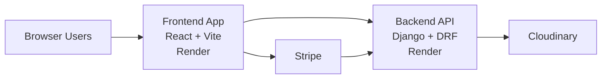

# Manley Lifting Platform
## Prospective Owner Handout

This document is the short-form version of the full project README. It is designed to be presentation-friendly and suitable for exporting to PDF as a client-facing handout.

---

## 1. What This Platform Is

Manley Lifting is more than a company website. It is a combined:

- public marketing site
- product shop
- customer portal
- internal inspection and compliance workflow system

In one platform, it supports lead generation, e-commerce, customer self-service, equipment tracking, inspection reporting, document management, and staff administration.

---

## 2. Why It Matters Commercially

This platform helps replace several common manual processes that growing businesses often rely on:

- email chains used to resend reports and certificates
- spreadsheets used to track equipment and due dates
- scattered PDF folders on shared drives
- ad-hoc report approvals over phone, text, or WhatsApp
- paper-based inspection notes that later need retyping
- unclear staff access permissions and shared logins

Instead of those fragmented workflows, the platform provides one controlled system with role-based access and structured records.

---

## 3. The Four Core Business Functions

### Public Website

The public site builds trust, explains services, and gives visitors clear actions:

- request a quote
- contact the business
- browse products
- access the portal

### Shop

The shop supports:

- product browsing
- cart management
- Stripe-based checkout
- order confirmation

### Customer Portal

Customers can:

- log in securely
- view their own company equipment
- access approved inspection reports
- access certificates and supporting records

### Internal Operations Portal

Owners and staff can:

- manage customers and employees
- manage equipment records
- create, review, edit, and approve inspection reports
- upload certificates and inspection images
- maintain an operational audit trail

---

## 4. Role-Based Access

A major strength of the platform is that it does not give every user the same experience.

### Customer

- views only their own company data
- can see approved records
- cannot manage internal workflows

### Engineer

- works across assigned customer accounts
- can create draft and submitted reports
- can upload supporting evidence
- can work operationally without owner-level controls

### Owner

- manages customers and employees
- reviews pending report approvals
- edits and approves reports
- sees the broadest cross-company operational picture

This role separation is one of the clearest signs that the platform was designed around real business operations rather than a generic login area.

---

## 5. Strongest Product Features

### Structured Equipment Records

Each equipment record can store:

- asset tag
- serial number
- status
- location
- inspection interval
- last inspected date
- next inspection due date

### Inspection Workflow

Reports support:

- draft save
- submission for approval
- owner approval
- revision history
- image attachments
- checklist-based defect tracking

### Certificates and Documents

The system links certificates to relevant equipment and reports so records are not lost in disconnected folders.

### Print-Ready Outputs

Reports and certificate-related print views are branded and presentation-ready.

### Audit Trail

Operational changes such as approvals, uploads, and status updates can be tracked.

---

## 6. Text Walkthrough of the Site

This section is a plain-language walkthrough you can read aloud in a meeting.

### Public Site Walkthrough

1. A visitor lands on the homepage and immediately sees the company positioning, core services, and trust messaging.
2. From the header and call-to-action buttons, the visitor can choose one of three paths:
  - contact the business for a quote
  - browse products in the shop
  - enter the customer portal
3. The contact route gives a straightforward enquiry flow for service-based leads.
4. The shop route supports product discovery, cart actions, and checkout.
5. Legal and policy pages are available from the footer, making the public site commercially complete.

### Portal Login Walkthrough

1. Portal users sign in through a dedicated login page.
2. After login, users are routed into role-appropriate experiences rather than a one-size-fits-all dashboard.
3. Session and access controls ensure users only see data they are allowed to see.

### Owner Walkthrough

1. The owner lands on a cross-customer operational view with key metrics and management controls.
2. From the customer list, the owner can open any customer profile to view company details and equipment.
3. Inside equipment records, the owner can view reports and certificates linked to that asset.
4. The owner can review submitted reports from the pending approvals queue.
5. Report lifecycle actions include review, edit, and approval.
6. The owner can manage employee access, roles, and company assignments from the same portal.

### Engineer Walkthrough

1. Engineers access assigned customer accounts and open equipment records.
2. They can create inspection reports with structured checklist items.
3. They can save work as drafts, return later, then submit for owner approval.
4. They can upload supporting evidence such as report images and certificates where allowed.

### Customer Walkthrough

1. Customers see only their own company scope.
2. They can view equipment records and approved documentation.
3. They do not see internal management actions (for example, employee controls or owner-only approval tools).

### Why This Walkthrough Matters in a Pitch

This flow demonstrates that the platform is built around real day-to-day operations:

- public visitors can become leads or buyers
- staff can execute operational work
- owners can control quality and approvals
- customers can self-serve records without constant manual follow-up

---

## 7. Architecture Snapshot

What this means in practical terms:

- the customer-facing app and backend are separated cleanly
- payments are handled through Stripe rather than custom payment logic
- media handling is separated into a dedicated image service
- the app is already deployed in a production-shaped way

---

## 8. KPI and Owner Value Story

This platform helps move the business from reactive admin to structured operations.

### What It Reduces

- manual report resend requests
- scattered document storage
- duplicated record keeping
- unclear ownership of approvals
- admin time spent answering routine status questions

### What It Improves

- customer self-service
- compliance visibility
- staff coordination
- management oversight
- professionalism in front of customers
- scalability for a growing team

### Practical ROI Narrative

For an owner, the strongest value is not just “more software features.” The real value is:

- fewer admin bottlenecks
- more consistent operational records
- stronger professionalism with customers
- better control over approvals and staff access
- a platform that already combines sales, service, and compliance workflows

---

## 9. Why This Is a Strong Ownership Asset

A prospective owner is not buying a single page website here. They are looking at a platform that already supports:

- lead generation
- product sales
- document delivery
- inspection workflow
- role-based administration
- customer retention through self-service access

That makes it much more valuable than a simple brochure site because it touches both revenue generation and operational efficiency.

---

## 10. Final Pitch

If presented well, the clearest message is this:

**Manley Lifting already has the foundation of a serious digital operations platform, not just a website.**

It helps the business sell, organise, document, approve, and deliver customer service in one place, while still leaving room for further commercial growth.
